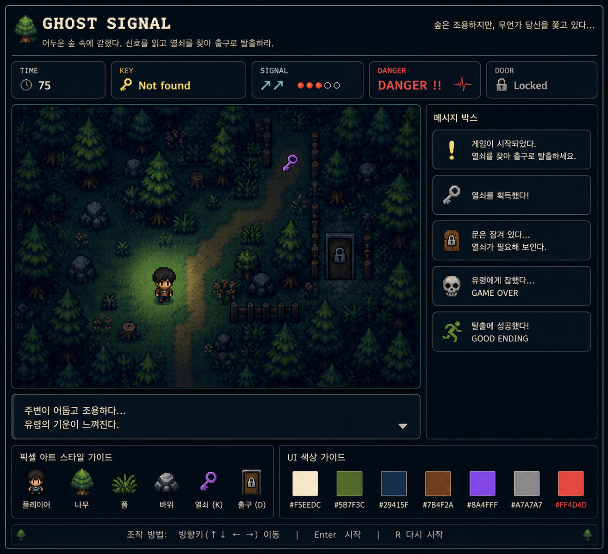

# Ghost Signal PRD

## 1. 게임 개요

Ghost Signal은 어두운 숲에서 유령의 추적을 피하면서 미로를 탈출하는 2D 픽셀 호러 탈출 게임이다.

플레이어는 제한 시간 안에 열쇠를 찾고, 잠긴 문을 열고, 총 3개의 스테이지를 통과해야 한다.
각 스테이지는 서로 다른 분위기와 난이도를 가지며, 스테이지가 올라갈수록 미로 구조가 더 복잡해지고 유령의 압박도 강해진다.

---

## 2. 핵심 목표

- 숲속 미로에서 길을 찾아 이동한다.
- Ghost Signal을 통해 유령의 위치를 추정한다.
- 열쇠를 찾는다.
- 문을 열고 다음 스테이지로 이동한다.
- 3스테이지까지 모두 통과하면 GOOD ENDING에 도달한다.

---

## 3. 게임 장르

- 2D Pixel Adventure
- Horror
- Maze Escape
- Survival

---

## 4. 플레이 규칙

### 기본 규칙

- 플레이어는 방향키로 이동한다.
- `Enter`는 시작 또는 오버레이 확인에 사용된다.
- `R`은 현재 진행을 다시 시작한다.
- 플레이어는 열쇠를 얻기 전에는 문을 통과할 수 없다.
- 문에 도달하면 다음 스테이지로 이동한다.

### 목숨 규칙

- 각 라운드는 목숨 2개로 시작한다.
- 유령에게 잡히면 목숨이 1 감소한다.
- 목숨이 남아 있으면 현재 스테이지의 시작점으로 복귀한다.
- 목숨이 0이 되면 GAME OVER가 발생한다.

### 시간 규칙

- 각 스테이지는 제한 시간이 있다.
- 시간이 0이 되면 GAME OVER가 발생한다.

---

## 5. 스테이지 구성

게임은 총 3단계로 구성된다.

### Stage 1

- 비교적 읽히는 길 구조
- 시야가 넓은 편
- 유령 추적이 느린 편
- 플레이어가 규칙을 익히는 초반 구간

### Stage 2

- 분기와 우회로가 늘어난 미로형 구간
- 길이 더 꼬이고 막다른 길이 많아진다
- 시야와 시간 여유가 줄어든다

### Stage 3

- 가장 복잡한 미로 구간
- 시야가 더 좁다
- 유령 추적이 가장 강하다
- 추가 압박 연출이 들어간다

---

## 6. HUD

상단 HUD는 다음 정보를 표시한다.

- TIME
- LIFE
- KEY
- SIGNAL
- DANGER
- DOOR

### HUD 상태 의미

- TIME: 남은 시간
- LIFE: 현재 목숨 수
- KEY: 열쇠 획득 여부
- SIGNAL: 유령 방향 신호
- DANGER: 유령과의 거리 위험도
- DOOR: 문 잠금 상태

---

## 7. Signal 시스템

Ghost Signal은 유령의 방향과 근접도를 알려주는 핵심 정보다.

### 방향 표시

- 위쪽
- 아래쪽
- 왼쪽
- 오른쪽
- 대각 방향

### 위험도 표시

- SAFE
- WARNING
- DANGER

거리가 가까워질수록 표시가 강해지고, 3스테이지에서는 더 빠르게 위험 상태로 전환된다.

---

## 8. 맵 구조

맵은 픽셀 기반 타일맵으로 구성된다.

### 타일 종류

- Player
- Tree
- Grass
- Rock
- Bush
- Dirt Path
- Fence
- Key
- Door
- Shadow
- Light Effect

### 생성 방식

- 기본 바닥을 벽 위주로 생성한다.
- 실제 통로만 미로 형태로 파낸다.
- 스테이지별로 분기 수와 루프 비율이 달라진다.
- 열쇠와 문은 반드시 통로 위에서만 배치된다.
- 문은 실제로 접근 가능한 칸에서만 선택된다.

---

## 9. 적 AI

유령은 플레이어를 추적하는 위협 요소다.

### 동작 규칙

- 플레이어와의 거리를 기준으로 이동한다.
- 위험 구간에서는 더 빠르게 추적한다.
- 3스테이지에서는 추가 추적 행동이 들어간다.
- 너무 가까워지면 체감 압박이 크게 올라간다.

### 충돌 결과

- 유령에게 닿으면 목숨을 잃는다.
- 목숨이 남아 있으면 시작점으로 복귀한다.
- 목숨이 모두 소진되면 GAME OVER다.

---

## 10. 열쇠 시스템

열쇠는 스테이지 진행의 핵심 아이템이다.

### 동작 규칙

- 열쇠는 매 스테이지마다 다른 위치에 생성된다.
- 열쇠는 미로 경로 위의 랜덤 지점에서 선택된다.
- 열쇠를 얻기 전에는 문을 열 수 없다.

### 상태 표시

- Not found
- KEY FOUND

---

## 11. 문 시스템

문은 다음 스테이지로 가는 출구다.

### 동작 규칙

- 문은 열쇠 획득 후에만 통과 가능하다.
- 문은 반드시 접근 가능한 통로 칸에 생성된다.
- 문에 도달하면 스테이지가 종료되고 다음 단계로 넘어간다.

### 상태 표시

- Locked
- Escape Available

---

## 12. 시간 제한

- 스테이지마다 제한 시간이 존재한다.
- 시간이 0이 되면 GAME OVER 처리한다.
- 스테이지가 올라갈수록 시간이 더 빡빡해진다.

---

## 13. 상태 메시지 박스

하단 메시지 박스는 플레이 상황을 안내한다.

### 예시 메시지

- 게임 시작
- 열쇠 획득
- 문이 잠겨 있음
- 유령에게 잡힘
- 스테이지 클리어
- GOOD ENDING

---

## 14. 시각 스타일

### 방향성

- GBA/NDS 감성의 레트로 픽셀 호러
- 어두운 숲, 낮은 채도, 신비로운 조명
- 카드형 HUD와 패널형 레이아웃

### 연출 요소

- 스테이지별 배경 색감 차등
- 스테이지별 안개 농도 차등
- 유령 근접 시 흔들림 연출
- 미로 내부는 시야 제한으로 탐색감 강화

---

## 15. 조작

| 키 | 기능 |
|---|---|
| 방향키 | 이동 |
| Enter | 시작 / 오버레이 확인 |
| R | 현재 진행 다시 시작 |

모바일에서는 방향 버튼으로 이동할 수 있다.

---

## 16. 게임 흐름

1. 시작 화면에서 Enter를 누른다.
2. 1스테이지 미로를 탐색한다.
3. 열쇠를 찾는다.
4. 문을 통과해 다음 스테이지로 이동한다.
5. 2스테이지, 3스테이지를 차례로 통과한다.
6. 마지막 스테이지를 클리어하면 GOOD ENDING이 나온다.
7. 목숨이 모두 소진되거나 시간이 0이 되면 GAME OVER다.

---

## 17. 데이터

현재 게임에서 유지되는 핵심 데이터는 다음과 같다.

- 현재 스테이지
- 남은 시간
- 남은 목숨
- 현재 플레이어 위치
- 열쇠 위치
- 문 위치
- 유령 위치
- 현재 획득 여부
- 메시지 로그

---

## 18. 확장 가능 기능

향후 추가하면 좋은 기능들:

- 더 다양한 미로 생성 패턴
- 스테이지별 BGM
- 유령의 시야/청각 AI 강화
- 장애물 상호작용
- 저장 기능
- 아이템 추가
- 여러 엔딩 분기

---

## 19. 최종 목표

이 게임의 목표는 단순한 탈출이 아니라,
유령의 추적 압박 속에서 미로를 읽고 살아남는 긴장감 있는 픽셀 호러 경험을 제공하는 것이다.

---

## 20. UI 참고

현재 화면은 레트로 공포 게임의 느낌을 살린 대시보드 스타일을 따른다.

